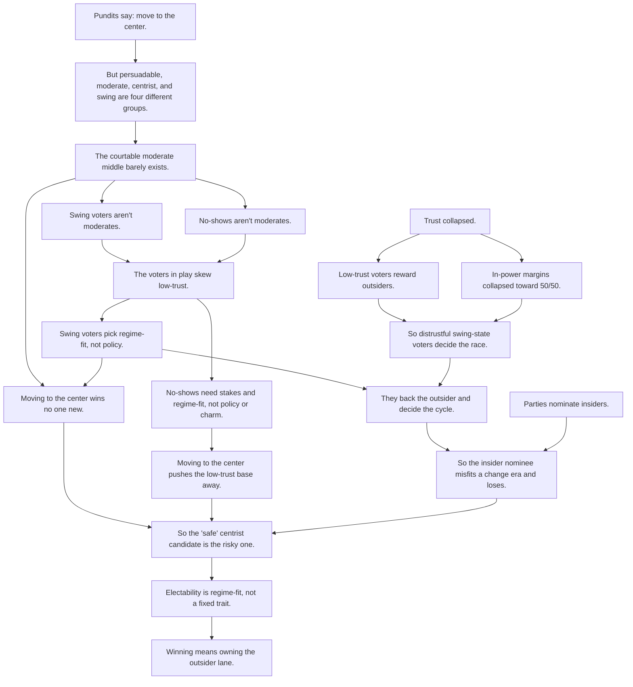

# Causal argument diagram — "The Center Is a Lie"

**Branch:** claude/dazzling-maxwell-sSHUR
**Created:** 2026-06-29
**Status:** Reference — spine-level causal map of the essay's argument

## Objective

A single-screen causal map of the essay's argument, written as plain declarative
statements (one claim per node). Derived from `web/index.html` (the source of
truth). Kept at "spine" altitude: load-bearing supports are listed but not drawn.

## Diagram

## Scope: supports deliberately omitted

These load-bearing claims sit *under* the spine nodes and are not drawn:

- **J / P** — late-campaign persuasion ≈ 0 (Kalla & Broockman, 49 field experiments).
- **J** — status loss + racial resentment (not policy) is what flips switchers; the
  authenticity halo flips on/off with who holds power (2016 ✓ / 2020 ✗ / 2024 ✓).
- **K** — contact is the top turnout lever; the no-show pool is splitting from
  *complacent* (high-trust, shrinking) to *alienated* (low-trust, now the majority).
- **N / O** — the nomination mechanism (Innovator's-Dilemma selection for insider markers).
- **T** — the two outsider styles: Bernie-style discipline vs. Trump-style flood.

## Adversarial-review notes (why the spine is shaped this way)

Seven fixes were made against an earlier draft, each because an arrow read as a
causal claim the essay does not support:

1. **`outsiders rewarded → pundits say move to center` was a false arrow.** The
   pundit advice is the older Downsian median-voter reflex; it is the *foil*, not an
   effect of voter behavior. → `D` is now an independent root.
2. **"center is not moderate" / "moderates are a mirage" were one muddled idea.** The
   essay's real claim is that persuadable ≠ moderate ≠ centrist ≠ swing (four groups),
   and the courtable middle is ~1 in 100. → Collapsed into `E` → `F`.
3. **"Both are low-trust" overclaimed.** Complacent no-shows are high-trust, and trust
   barely discriminates across the whole electorate (a near-universal floor). It is the
   *deciders* who are low-trust. → Softened to "skew low-trust" (`I`).
4. **`levers → pivotal voter` conflated what voters respond to with who is pivotal.**
   The swing-state Critic is identified by low trust + thin margins + the Electoral
   College, not by the regime-fit lever. → margins + outsider-reward *identify* the
   voter (`L`); regime-fit choice *explains the behavior* (`M`).
5. **`decides the cycle → parties nominate insiders` was a non-sequitur.** Party
   selection of insiders is an independent structural fact, not an effect of the
   pivotal voter. → `N` is its own premise that *joins* `M` to yield `O`.
6. **"pushes the base away" was mis-sourced.** It follows from the base-in-play being
   low-trust/anti-establishment (the turnout side, `K`), not from the swing-voter rule.
7. **Electoral College / swing-*state* geography was doing real work and was missing.**
   → Folded into `L`.

## References

- Source essay: `web/index.html`
- Companion synthesis: `reqts/master-argument.md`
